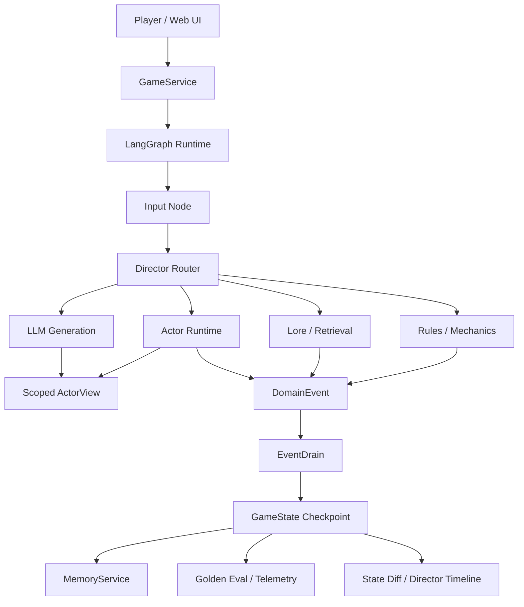

# Controlled Agent Sim Runtime

[中文 README](README.zh-CN.md)

A bounded LLM agent runtime for building, operating, and evaluating multi-agent workflows inside an inspectable simulation.

Hazard Lab is the compact vertical slice used to stress-test the infrastructure. It creates pressure around hidden information, delegated actions, long-running memory, deterministic state commits, and observable consequences. The reusable value is the agent runtime: scoped perception, typed events, replayable evals, and an operator-facing debugging surface.

## Engineering Evidence

This repository is evaluated through command-backed evidence rather than screenshots or subjective demo claims.

```bash
python scripts/generate_evidence_report.py
```

Latest local evidence:

| Gate | Result |
| --- | --- |
| Python tests | `460 passed` |
| Golden replay evals | `50/50 passed` |
| Web UI tests | `285 passed` |
| Benchmark dry-run | `4 cases selected` |

See [Engineering Evidence Report](docs/evidence-report.md) for the reproducible report and the runtime claims it backs.

## Runtime Capabilities

| Capability | Project evidence |
| --- | --- |
| 0-to-1 delivery | FastAPI service, LangGraph runtime, web UI, eval runner, benchmark tooling, and a runnable Hazard Lab demo live in one repo. |
| Agent workflow control | LLM-facing nodes interpret intent and generate expression, while deterministic systems own mechanics, inventory, state mutation, and replay. |
| Web full stack | `server.py` exposes `/api/chat` and `/api/state`; `web_ui/` renders the map, Director Timeline, payload inspector, and state diff. |
| Runtime boundaries | `ActorView`, `DomainEvent`, `EventDrain`, memory services, graph routing, and visibility policy form explicit contracts instead of ad hoc prompts. |
| Delivery quality | `pytest`, golden replay evals, UI tests, and benchmark dry-runs provide regression gates that can run without live model calls. |

Project notes:

- [Case Study](docs/case-study.md)
- [Demo Walkthrough](docs/demo-walkthrough.md)
- [Runtime Architecture](docs/runtime-architecture.md)
- [Engineering Evidence Report](docs/evidence-report.md)

## Why This Exists

LLM agents become useful in production only when their freedom is bounded by explicit runtime contracts. This project separates:

- **LLMs** for intent interpretation, agent expression, and open-ended dialogue.
- **Deterministic systems** for movement, checks, inventory, memory writes, world flags, damage, and final state commits.
- **Typed events** for all state mutation through `DomainEvent` and `EventDrain`.
- **Actor-scoped views** so each agent receives only authorized world state.
- **Golden replay evals** to keep agent behavior, visibility, and event application regression-testable.
- **Operator observability** so route decisions, payloads, state diffs, and benchmark results can be inspected rather than inferred.

## System Highlights

- **Agent workflow chain:** player input flows through routing, mechanics, actor runtime, event drain, generation, and UI feedback as inspectable stages.
- **Scoped perception:** `ActorView` filters flags, environment objects, peer state, visible history, and private memory before an agent can respond.
- **State safety boundary:** LLM output can propose intent and speech, but authoritative changes land through deterministic event handlers.
- **Multi-agent runtime:** Scout, Analyst, and Tactician carry different agendas, memories, and risk models instead of acting as one generic assistant voice.
- **Replayable evals:** YAML golden cases validate routing, memory isolation, item transfer, hazard handling, and scenario outcomes without live model calls.
- **Performance visibility:** benchmark tooling compares graph-routed scoped prompts against a naive full-state agent baseline.
- **Operator-facing UI:** the browser demo shows map state, agent barks, dice/check feedback, state diffs, a Director Timeline, and a runtime evidence panel.

## Demo Scenario

Hazard Lab is a vertical slice for controlled agent behavior:

1. The team wakes in a sealed facility.
2. Scout detects a hidden gas trap through actor-specific perception.
3. The player delegates disarm, lock, and open actions to agents.
4. Analyst interprets lab notes and updates shared knowledge.
5. The team confronts the Gatekeeper, whose response changes if earlier evidence was discovered.
6. Final escape requires a key transfer committed through deterministic events.

The scenario is deliberately small. Its purpose is to demonstrate system architecture, not game content volume.

## Architecture



## Quick Start

```bash
pip install -r requirements.txt
python server.py
```

Open:

```text
http://127.0.0.1:8000/web_ui/?map_id=hazard_lab
```

For a clean local demo session:

```text
http://127.0.0.1:8000/web_ui/?session_id=demo_run_001&map_id=hazard_lab&qa_no_idle=1
```

## Tests And Evals

```bash
pytest -q
python -m core.eval.runner --suite golden
python scripts/generate_benchmark.py --dry-run --max-cases 4
python scripts/generate_evidence_report.py
make check
```

Real LLM benchmark:

```bash
python scripts/generate_benchmark.py --max-cases 4
```

## Repository Map

```text
core/application/      GameService orchestration boundary
core/graph/            LangGraph state machine, nodes, and routing
core/actors/           ActorView, ActorRuntime, registry, visibility contracts
core/events/           DomainEvent models, apply path, event store
core/memory/           Memory scopes, retrieval, distillation, service layer
core/systems/          dice, mechanics, world init, pathfinding, inventory
core/eval/             Golden replay runner, assertions, telemetry, reports
evals/golden/          deterministic regression cases
evals/benchmark/       real LLM benchmark cases
web_ui/                browser demo and Director Timeline
docs/                  architecture, case study, demo notes, evidence report
```

## Scope

This is not a model-training project and not a content-heavy game. It is a working agent infrastructure prototype focused on bounded autonomy: scoped perception, memory isolation, deterministic state commits, replayable evaluation, and observable runtime behavior.

The game-like scenario is intentionally compact because its purpose is to make AI engineering decisions visible: what the agent can see, which route was selected, which deterministic system committed state, and how the result is tested.
