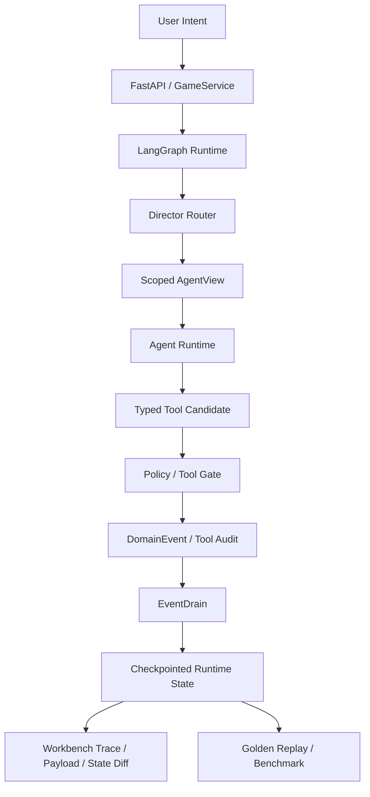

# Controlled Agent Runtime Workbench

[中文 README](README.zh-CN.md)

This project is a working runtime for controlling LLM agents before they call tools or mutate state.

It answers a practical engineering question: when a user gives an intent, how do we decide which agent should handle it, what that agent is allowed to see, which tools it can call, whether the tool call is safe, and how the result is committed in an auditable way?

The browser workbench makes that flow visible:

```text
Intent -> Director Router -> Scoped AgentView -> Agent Runtime -> Tool Gate -> EventDrain -> Trace / State Diff
```

Hazard Lab is kept as a compact stateful scenario behind the workbench. It is not the main product surface; it is a stress test for hidden state, multi-agent coordination, memory, and deterministic commits.

## What To Look At

The three screenshots below are generated from the same runtime with different URL presets. They show that the system is not just changing text labels: different agents receive different tool permissions, masked fields, gate decisions, and committed events.

| Workflow | Runtime behavior |
| --- | --- |
| Ops Agent | Can publish a policy patch only after eval and schema checks pass. |
| Research Agent | Can search and retrieve knowledge-base context, but has no deploy/publish tools. |
| Reviewer Agent | Can read CI/eval status and write an audit log, but direct publish is blocked. |


## Why This Matters

Many agent demos let the model see too much context and imply state changes through generated text. That is hard to trust in a real workflow.

This runtime separates the responsibilities:

- `Director Router` chooses the route and target agent before generation.
- `Scoped AgentView` builds the agent-specific prompt slice, allowed tools, visible fields, and memory scope.
- `Agent Runtime` prepares a typed action or tool candidate.
- `Tool Gate` validates role permission, schema, and preconditions.
- `EventDrain` commits typed events into durable state so the result is replayable and inspectable.
- The Web workbench exposes the trace, payload summary, state diff, and committed events.

The reusable idea is bounded autonomy: the LLM can interpret intent and propose actions, but the runtime owns context boundaries, tool permissions, state mutation, and regression checks.

## Engineering Evidence

Run the reproducible evidence script:

```bash
python scripts/generate_evidence_report.py
```

Latest local result:

| Gate | Result |
| --- | --- |
| Python tests | `460 passed` |
| Golden replay evals | `50/50 passed` |
| Web UI tests | `286 passed` |
| Benchmark dry-run | `4 cases selected` |

See [Engineering Evidence Report](docs/evidence-report.md) for the generated report.

## Run It Locally

```bash
pip install -r requirements.txt
python server.py
```

Open the workbench:

```text
http://127.0.0.1:8000/web_ui/?session_id=demo_run_001&map_id=hazard_lab&qa_no_idle=1
```

Reproduce the screenshot presets:

```text
http://127.0.0.1:8000/web_ui/?session_id=workflow_ops&map_id=hazard_lab&qa_no_idle=1&workbench_static=1&workbench_preset=policy_publish
http://127.0.0.1:8000/web_ui/?session_id=workflow_research&map_id=hazard_lab&qa_no_idle=1&workbench_static=1&workbench_preset=ticket_triage
http://127.0.0.1:8000/web_ui/?session_id=workflow_reviewer&map_id=hazard_lab&qa_no_idle=1&workbench_static=1&workbench_preset=release_audit
```

## Test And Evaluation Commands

```bash
pytest -q
python -m core.eval.runner --suite golden
python scripts/generate_benchmark.py --dry-run --max-cases 4
npm test
make check
```

## Architecture



## Repository Map

```text
core/application/      service boundary shared by API, UI, evals, and benchmarks
core/graph/            LangGraph state machine, routing, and node orchestration
core/actors/           ActorView, ActorRuntime, registry, visibility contracts
core/events/           typed events, apply path, event store
core/memory/           scoped memory, retrieval, distillation, service layer
core/eval/             golden replay runner, assertions, telemetry, reports
evals/golden/          deterministic replay cases
evals/benchmark/       benchmark cases for model-backed runs
web_ui/                Runtime Workbench, Director Timeline, payload inspector, state diff
docs/                  walkthrough, architecture, case study, evidence report
```

## Project Boundary

This is not a model-training project and not a content-volume showcase. The scenario preview is intentionally small. The project focuses on the runtime infrastructure needed to make agent behavior bounded, observable, replayable, and testable.
