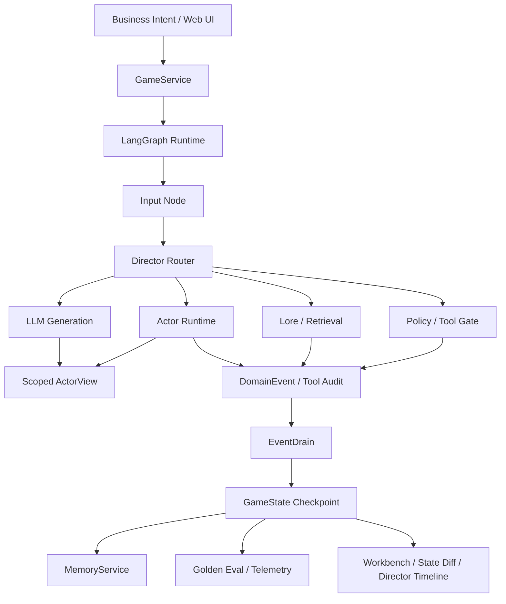

# Controlled Agent Sim Runtime

[中文 README](README.zh-CN.md)

A bounded LLM agent runtime for building, operating, and evaluating multi-agent workflows through an inspectable Web workbench.

The Web workbench presents business-shaped tool orchestration traces: a user intent enters the runtime, the Director selects a route and target agent, `ActorView` builds a scoped prompt/tool/data view, policy gates validate the tool call, and `EventDrain` commits typed audit events. Hazard Lab remains the compact scenario preview used to stress-test hidden state, delegated actions, memory, and deterministic commits.

## Engineering Evidence

This repository is evaluated through command-backed evidence rather than screenshots or subjective demo claims.

```bash
python scripts/generate_evidence_report.py
```

Latest local evidence:

| Gate | Result |
| --- | --- |
| Python tests | `460 passed` |
| Golden replay evals | `50/50 passed` |
| Web UI tests | `285 passed` |
| Benchmark dry-run | `4 cases selected` |

See [Engineering Evidence Report](docs/evidence-report.md) for the reproducible report and the runtime claims it backs.

## Runtime Capabilities

| Capability | Project evidence |
| --- | --- |
| 0-to-1 delivery | FastAPI service, LangGraph runtime, Web workbench, eval runner, benchmark tooling, and a runnable scenario preview live in one repo. |
| Agent workflow control | LLM-facing nodes interpret intent and generate expression, while deterministic systems own tool gates, state mutation, audit events, and replay. |
| Web full stack | `server.py` exposes `/api/chat` and `/api/state`; `web_ui/` renders the Runtime Workbench, Director Timeline, payload inspector, state diff, and scenario preview. |
| Runtime boundaries | `ActorView`, tool allowlists, masked fields, `DomainEvent`, `EventDrain`, memory services, graph routing, and visibility policy form explicit contracts instead of ad hoc prompts. |
| Delivery quality | `pytest`, golden replay evals, UI tests, and benchmark dry-runs provide regression gates that can run without live model calls. |

Project notes:

- [Case Study](docs/case-study.md)
- [Demo Walkthrough](docs/demo-walkthrough.md)
- [Runtime Architecture](docs/runtime-architecture.md)
- [Engineering Evidence Report](docs/evidence-report.md)

## Why This Exists

LLM agents become useful in production only when their freedom is bounded by explicit runtime contracts. This project separates:

- **LLMs** for intent interpretation, agent expression, and final response generation.
- **Deterministic systems** for tool gates, permission checks, inventory, memory writes, world flags, damage, and final state commits.
- **Typed events** for all state mutation through `DomainEvent` and `EventDrain`.
- **Actor-scoped views** so each agent receives only authorized world state.
- **Golden replay evals** to keep agent behavior, visibility, and event application regression-testable.
- **Operator observability** so route decisions, payloads, state diffs, and benchmark results can be inspected rather than inferred.

## System Highlights

- **Agent workflow chain:** business intent flows through routing, scoped AgentView, actor runtime, policy/tool gate, event drain, generation, and UI feedback as inspectable stages.
- **Scoped AgentView:** `ActorView` filters prompt slices, allowed tools, visible fields, peer state, visible history, and private memory before an agent can respond or call tools.
- **State safety boundary:** LLM output can propose intent, speech, and tool candidates, but authoritative changes land through deterministic event handlers.
- **Multi-agent runtime:** the workbench presets model Ops, Research, and Reviewer agents with distinct context scopes, tool permissions, memories, and risk models instead of one generic assistant voice.
- **Replayable evals:** YAML golden cases validate routing, memory isolation, item transfer, hazard handling, and scenario outcomes without live model calls.
- **Performance visibility:** benchmark tooling compares graph-routed scoped prompts against a naive full-state agent baseline.
- **Operator-facing UI:** the browser workbench shows business-shaped tool orchestration, scoped AgentView, payload inspection, state diffs, Director Timeline, and a scenario preview.

## Workbench Scenario

The default Web surface is an Agent Runtime Workbench:

1. A business intent requests an agent to call a tool, such as `publish_policy_patch`.
2. Director Router classifies the route, target agent, and fallback.
3. Scoped AgentView limits prompt context, data fields, and tool allowlists by role.
4. Agent Runtime prepares a typed tool candidate.
5. Policy / Tool Gate validates schema, permission, and preconditions.
6. EventDrain commits `TOOL_CALL_APPROVED`, blocked actions, and audit events.

Hazard Lab is still included as the compact scenario preview behind the workbench. Its purpose is to keep the runtime grounded in a stateful environment while the primary review surface focuses on agent orchestration.

## Architecture



## Quick Start

```bash
pip install -r requirements.txt
python server.py
```

Open:

```text
http://127.0.0.1:8000/web_ui/?map_id=hazard_lab
```

For a clean local demo session:

```text
http://127.0.0.1:8000/web_ui/?session_id=demo_run_001&map_id=hazard_lab&qa_no_idle=1
```

## Tests And Evals

```bash
pytest -q
python -m core.eval.runner --suite golden
python scripts/generate_benchmark.py --dry-run --max-cases 4
python scripts/generate_evidence_report.py
make check
```

Real LLM benchmark:

```bash
python scripts/generate_benchmark.py --max-cases 4
```

## Repository Map

```text
core/application/      GameService orchestration boundary
core/graph/            LangGraph state machine, nodes, and routing
core/actors/           ActorView, ActorRuntime, registry, visibility contracts
core/events/           DomainEvent models, apply path, event store
core/memory/           Memory scopes, retrieval, distillation, service layer
core/systems/          dice, mechanics, world init, pathfinding, inventory
core/eval/             Golden replay runner, assertions, telemetry, reports
evals/golden/          deterministic regression cases
evals/benchmark/       real LLM benchmark cases
web_ui/                Runtime Workbench, scenario preview, and Director Timeline
docs/                  architecture, case study, demo notes, evidence report
```

## Scope

This is not a model-training project and not a content-volume showcase. It is a working agent infrastructure prototype focused on bounded autonomy: scoped tool/prompt context, memory isolation, deterministic state commits, replayable evaluation, and observable runtime behavior.

The scenario preview is intentionally compact because its purpose is to make AI engineering decisions visible: what the agent can see, which tools it can call, which route was selected, which deterministic system committed state, and how the result is tested.
