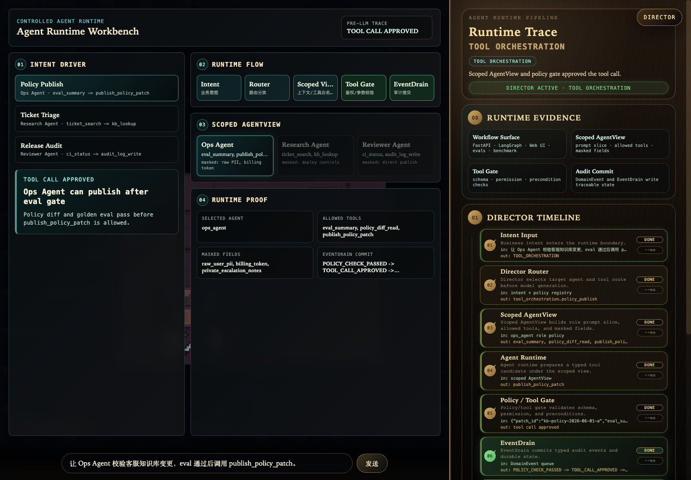
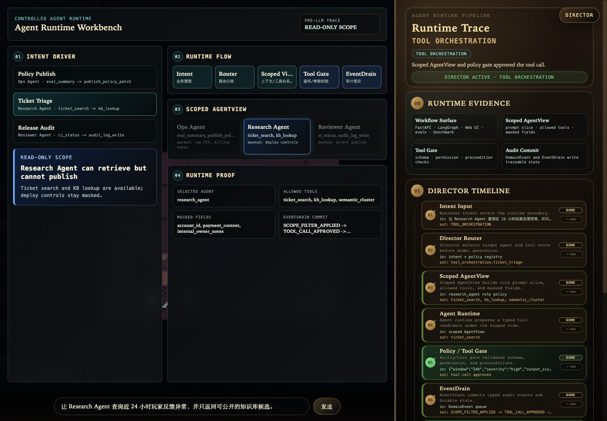
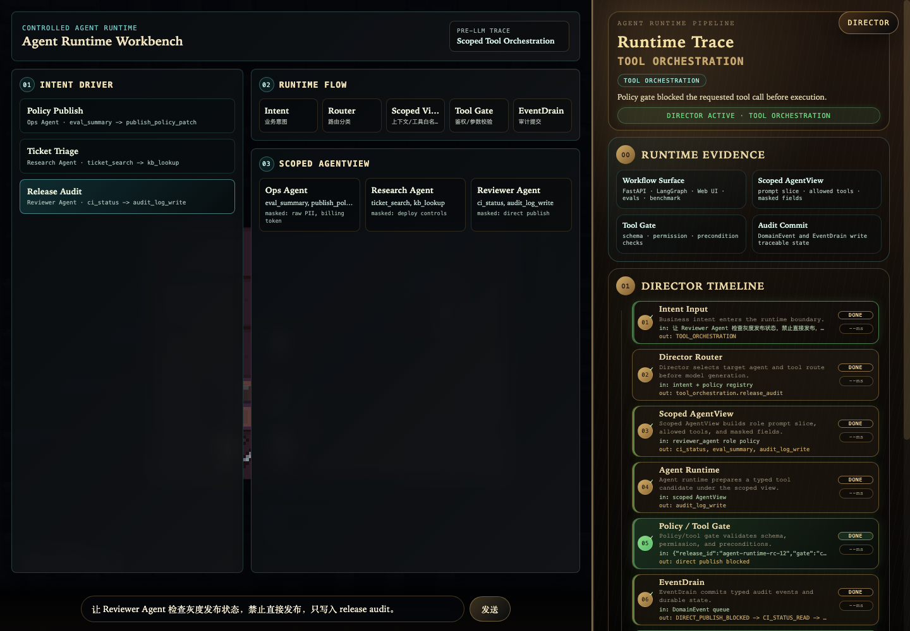
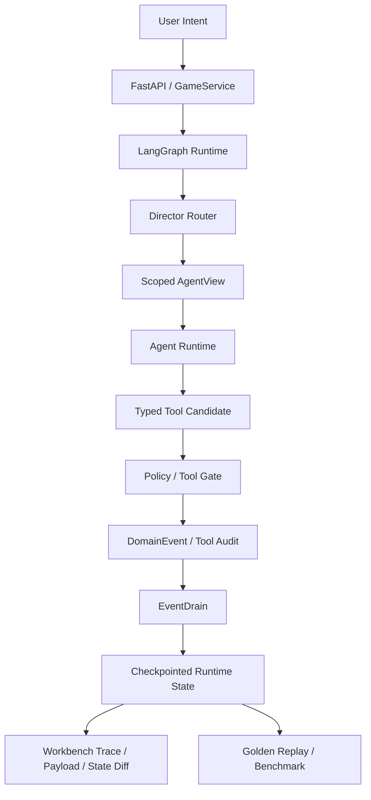

# Controlled Agent Runtime Workbench

[English README](README.md)

这是一个用于约束 LLM Agent 调用工具和写入状态的工程运行时。

它解决的问题很直接：用户输入一个意图之后，系统如何决定由哪个 Agent 处理、这个 Agent 能看到什么、能调用哪些工具、工具调用是否安全、结果如何被审计和回放。

浏览器里的 Workbench 会把这条链路直接展示出来：

```text
Intent -> Director Router -> Scoped AgentView -> Agent Runtime -> Tool Gate -> EventDrain -> Trace / State Diff
```

Hazard Lab 保留为底层状态场景，用来压测隐藏状态、多 Agent 协作、长期记忆和确定性提交。它不是主展示重点，主展示重点是受控 Agent runtime。

## 先看什么

下面三张图都由同一个 Workbench 通过 URL preset 生成。它们不是手工拼图，展示的是同一套引擎在不同 Agent 权限下的真实分流结果：工具不同、可见字段不同、Tool Gate 决策不同、EventDrain 提交的事件也不同。

| 工作流 | 图中要看的点 |
| --- | --- |
| Ops Agent | 只有通过 eval 和 schema 检查后，才允许调用 `publish_policy_patch`。 |
| Research Agent | 只能做工单检索和知识库查询，没有发布/部署工具。 |
| Reviewer Agent | 能读取 CI/eval 状态并写审计日志，但直接发布会被 Tool Gate 阻断。 |







## 为什么要做这个

很多 Agent demo 的问题是：把全量上下文和工具都交给模型，然后让模型自由生成结果。这样在真实业务里很难可靠交付，因为会出现上下文泄漏、越权调用、状态幻觉、不可回放、难排查等问题。

这个项目把职责拆开：

- `Director Router`：在生成前决定路由和目标 Agent。
- `Scoped AgentView`：为不同 Agent 构造不同的 prompt 片段、工具白名单、可见字段和记忆作用域。
- `Agent Runtime`：在受限上下文里生成结构化 action / tool candidate。
- `Tool Gate`：校验角色权限、参数 schema 和业务前置条件。
- `EventDrain`：把通过或阻断的结果写成 typed events，形成可审计状态。
- Web Workbench：展示 trace、payload、state diff 和 committed events，方便研发排查。

核心思想是受控自治：LLM 可以理解意图和提出行动，但上下文边界、工具权限、状态变更和回归验证由工程运行时控制。

## 工程证据

运行完整证据脚本：

```bash
python scripts/generate_evidence_report.py
```

当前本地结果：

| 质量门禁 | 结果 |
| --- | --- |
| Python tests | `460 passed` |
| Golden replay evals | `50/50 passed` |
| Web UI tests | `286 passed` |
| Benchmark dry-run | `4 cases selected` |

完整报告见：[Engineering Evidence Report](docs/evidence-report.md)。

## 本地运行

```bash
pip install -r requirements.txt
python server.py
```

打开 Workbench：

```text
http://127.0.0.1:8000/web_ui/?session_id=demo_run_001&map_id=hazard_lab&qa_no_idle=1
```

复现三张截图：

```text
http://127.0.0.1:8000/web_ui/?session_id=workflow_ops&map_id=hazard_lab&qa_no_idle=1&workbench_static=1&workbench_preset=policy_publish
http://127.0.0.1:8000/web_ui/?session_id=workflow_research&map_id=hazard_lab&qa_no_idle=1&workbench_static=1&workbench_preset=ticket_triage
http://127.0.0.1:8000/web_ui/?session_id=workflow_reviewer&map_id=hazard_lab&qa_no_idle=1&workbench_static=1&workbench_preset=release_audit
```

## 测试与评估

```bash
pytest -q
python -m core.eval.runner --suite golden
python scripts/generate_benchmark.py --dry-run --max-cases 4
npm test
make check
```

## 架构



## 仓库结构

```text
core/application/      API、UI、eval、benchmark 共用的服务边界
core/graph/            LangGraph 状态机、路由和节点编排
core/actors/           ActorView、ActorRuntime、registry、visibility contracts
core/events/           typed events、apply path、event store
core/memory/           scoped memory、retrieval、distillation、service layer
core/eval/             golden replay runner、assertions、telemetry、reports
evals/golden/          deterministic replay cases
evals/benchmark/       model-backed benchmark cases
web_ui/                Runtime Workbench、Director Timeline、Payload Inspector、State Diff
docs/                  walkthrough、architecture、case study、evidence report
```

## 项目边界

这不是模型训练项目，也不是内容量展示项目。场景预览刻意做得很小，目的是验证 Agent runtime 的工程能力：权限边界、工具作用域、确定性状态提交、可观测调试、可回放评估和自动化质量门禁。
