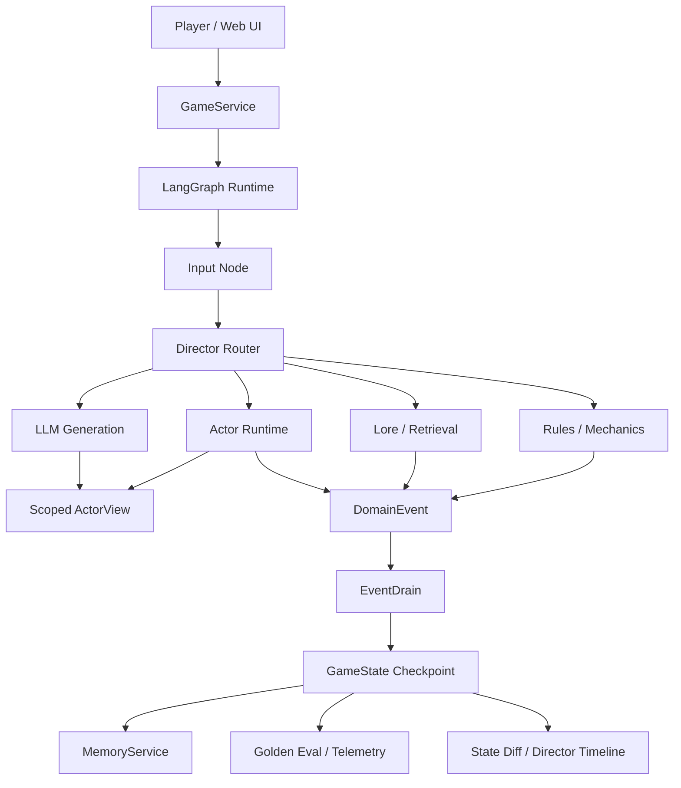

# Controlled Agent Sim Runtime

一个用于构建、运行、调试和评估受控 LLM Agent 的多智能体仿真运行时。

这个项目不是为了展示游戏内容量，也不是模型训练项目。Hazard Lab 是一个紧凑的压力测试场景，用来模拟复杂系统里的多角色协作、隐藏信息、权限边界、长期记忆、状态提交和可观测调试问题。项目核心价值是证明：LLM Agent 可以被放进一个有边界、有状态、有测试、有观测的工程系统里。

## 工程证据

本仓库优先提供可复现的工程证据，而不是依赖截图或主观 demo 描述。

```bash
python scripts/generate_evidence_report.py
```

当前本地证据：

| 质量门禁 | 结果 |
| --- | --- |
| Python tests | `460 passed` |
| Golden replay evals | `50/50 passed` |
| Web UI tests | `285 passed` |
| Benchmark dry-run | `4 cases selected` |

完整报告见：[Engineering Evidence Report](docs/evidence-report.md)。

## 运行时能力

| 能力 | 项目证据 |
| --- | --- |
| 从 0 到 1 交付 | FastAPI 服务、LangGraph 工作流、Web UI、eval runner、benchmark tooling 和可运行 demo 集成在一个项目中。 |
| Agent 工作流控制 | 将 Agent 行为拆解为意图识别、作用域感知、规则结算、状态提交、生成输出和可观测调试，而不是只堆 Prompt。 |
| Web 全栈能力 | `server.py` 提供 `/api/chat`、`/api/state`；`web_ui/` 提供 Director Timeline、Payload Inspector、State Diff 和交互界面。 |
| 运行时边界 | `ActorView`、`DomainEvent`、`EventDrain`、MemoryService、graph routing 和 visibility policy 构成明确的工程边界。 |
| 交付质量 | pytest、golden replay、Jest UI test、benchmark dry-run 形成可重复运行的质量门禁。 |

相关材料：

- [Case Study](docs/case-study.md)
- [Demo Walkthrough](docs/demo-walkthrough.md)
- [Runtime Architecture](docs/runtime-architecture.md)
- [工程证据报告](docs/evidence-report.md)

## 为什么要做

普通 LLM Agent demo 常见问题是：把大量全局状态塞给模型，让模型自由生成结果，再由人肉判断是否合理。这种方式在复杂业务场景里很难交付，因为它容易出现隐藏信息泄漏、状态幻觉、不可复现、难调试等问题。

本项目将职责拆开：

- **LLM**：负责意图理解、开放式表达和角色语言生成。
- **ActorView**：负责为不同 Agent 过滤可见上下文，避免把全局状态直接暴露给单个智能体。
- **DomainEvent / EventDrain**：负责物品、世界标记、记忆、伤害、好感等权威状态提交。
- **Golden replay evals**：负责在不调用真实模型的情况下回放关键行为路径，验证回归稳定性。
- **Director Timeline / Payload Inspector / State Diff**：负责让研发人员看到一次输入如何经过路由、规则、Agent 和状态提交。

## 核心能力

- **受控 Agent 工作流**：输入经过 Input、Director Router、Mechanics、Actor Runtime、Generation、EventDrain 等节点，而不是所有逻辑都放在一个 Prompt 里。
- **作用域感知**：不同 Agent 只能接收被授权的 flags、环境对象、历史消息、同伴状态和私有记忆。
- **确定性状态提交**：LLM 可以提出意图和表达，但状态变更由 typed event 和 deterministic handler 统一落库。
- **多智能体协作**：Scout、Analyst、Tactician 拥有不同视角、记忆和行为倾向，用于验证协作和冲突场景。
- **可回放评估**：YAML golden cases 覆盖路由、记忆隔离、道具转移、陷阱处理、分支选择和结局路径。
- **研发可观测性**：Web UI 暴露路由链路、payload 摘要和状态 diff，降低 Agent 行为排查成本。

## 架构



## 快速启动

```bash
pip install -r requirements.txt
python server.py
```

打开：

```text
http://127.0.0.1:8000/web_ui/?map_id=hazard_lab
```

干净演示会话：

```text
http://127.0.0.1:8000/web_ui/?session_id=demo_run_001&map_id=hazard_lab&qa_no_idle=1
```

## 测试与评估

```bash
pytest -q
python -m core.eval.runner --suite golden
python scripts/generate_benchmark.py --dry-run --max-cases 4
python scripts/generate_evidence_report.py
make check
```

真实 LLM benchmark 需要模型服务配置：

```bash
python scripts/generate_benchmark.py --max-cases 4
```

## 仓库结构

```text
core/application/      GameService 编排边界
core/graph/            LangGraph 状态机、节点和路由
core/actors/           ActorView、ActorRuntime、registry、visibility contracts
core/events/           DomainEvent models、apply path、event store
core/memory/           Memory scopes、retrieval、distillation、service layer
core/systems/          dice、mechanics、world init、pathfinding、inventory
core/eval/             Golden replay runner、assertions、telemetry、reports
evals/golden/          deterministic regression cases
evals/benchmark/       real LLM benchmark cases
web_ui/                browser demo、Director Timeline、State Diff
docs/                  architecture、case study、demo notes、evidence report
```

## 项目边界

这个项目不是证明“做了一个 AI 游戏 demo”，而是证明 LLM Agent 可以被放进一个有权限边界、有确定性状态提交、有回放评估、有可观测调试界面的工程系统里。游戏化场景只是压力测试，真正可复用的是受控 Agent runtime 和质量门禁。
