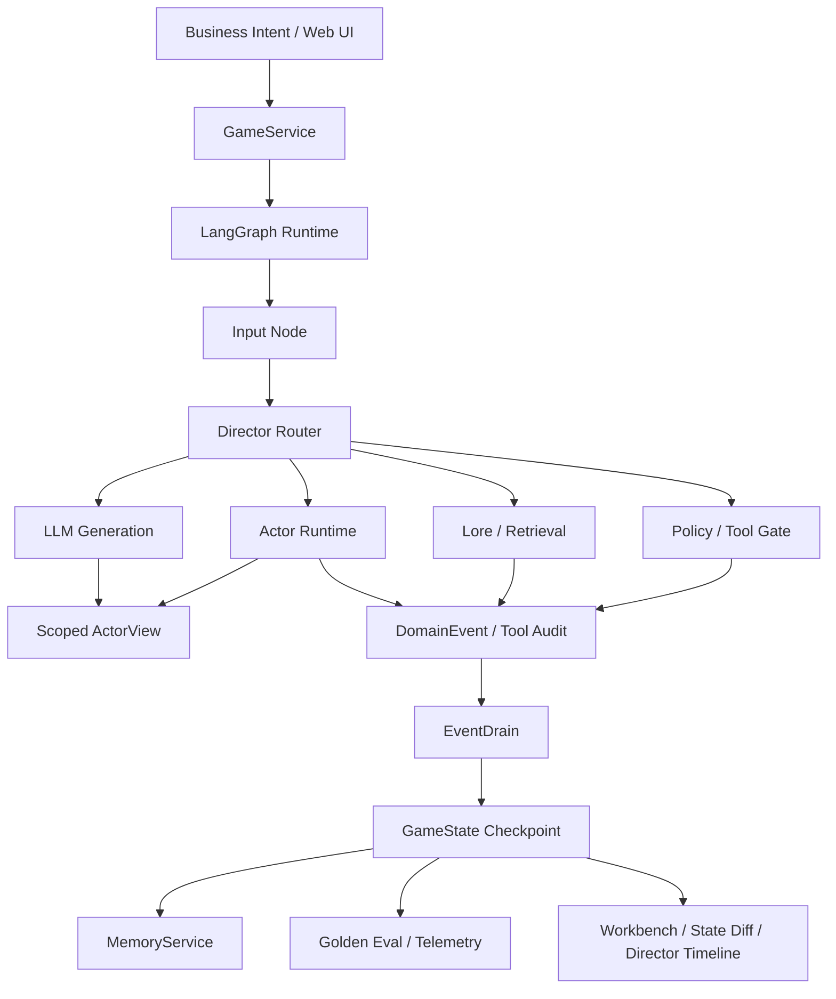

# Controlled Agent Sim Runtime

一个通过 Web Workbench 构建、运行、调试和评估受控 LLM Agent 的多智能体运行时。

默认 Web 界面已经改成 Agent Runtime Workbench：一个业务意图进入系统后，Director 先做路由，`ActorView` 构造角色级 prompt / 工具 / 数据作用域，Tool Gate 做权限和参数校验，最后由 `EventDrain` 提交审计事件。Hazard Lab 保留为底层压力测试场景，用来验证隐藏状态、多角色协作、长期记忆和确定性状态提交。

## 工程证据

本仓库优先提供可复现的工程证据，而不是依赖截图或主观 demo 描述。

```bash
python scripts/generate_evidence_report.py
```

当前本地证据：

| 质量门禁 | 结果 |
| --- | --- |
| Python tests | `460 passed` |
| Golden replay evals | `50/50 passed` |
| Web UI tests | `286 passed` |
| Benchmark dry-run | `4 cases selected` |

完整报告见：[Engineering Evidence Report](docs/evidence-report.md)。

## Agent 工作流示例

下面三张图都来自同一个 Web Workbench 的 URL preset，不是手工拼图。它们用于快速说明运行时行为；真正的回归证据仍然是上面的测试、golden replay 和 benchmark dry-run。

| Agent 工作流 | 图中证明点 |
| --- | --- |
| Ops Agent | 发布策略变更的意图被路由到 Ops Agent，只拿到 Ops 工具白名单，通过 Tool Gate 后提交 `TOOL_CALL_APPROVED`。 |
| Research Agent | 工单归因意图被路由到只读 Research 作用域，只能使用检索/聚类工具，发布控制字段被屏蔽。 |
| Reviewer Agent | 发布审计意图被路由到 Reviewer 作用域，直接发布被 Tool Gate 阻断，但审计事件仍然落入 EventDrain。 |


## 运行时能力

| 能力 | 项目证据 |
| --- | --- |
| 从 0 到 1 交付 | FastAPI 服务、LangGraph 工作流、Runtime Workbench、eval runner、benchmark tooling 和可运行 scenario preview 集成在一个项目中。 |
| Agent 工作流控制 | 将 Agent 行为拆解为意图识别、角色作用域、工具白名单、权限校验、状态提交、生成输出和可观测调试，而不是只堆 Prompt。 |
| Web 全栈能力 | `server.py` 提供 `/api/chat`、`/api/state`；`web_ui/` 提供 Runtime Workbench、Director Timeline、Payload Inspector、State Diff 和场景预览。 |
| 运行时边界 | `ActorView`、工具 allowlist、masked fields、`DomainEvent`、`EventDrain`、MemoryService、graph routing 和 visibility policy 构成明确的工程边界。 |
| 交付质量 | pytest、golden replay、Jest UI test、benchmark dry-run 形成可重复运行的质量门禁。 |

相关材料：

- [Case Study](docs/case-study.md)
- [Demo Walkthrough](docs/demo-walkthrough.md)
- [Runtime Architecture](docs/runtime-architecture.md)
- [工程证据报告](docs/evidence-report.md)

## 为什么要做

普通 LLM Agent demo 常见问题是：把大量全局状态塞给模型，让模型自由生成结果，再由人肉判断是否合理。这种方式在复杂业务场景里很难交付，因为它容易出现隐藏信息泄漏、状态幻觉、不可复现、难调试等问题。

本项目将职责拆开：

- **LLM**：负责意图理解、开放式表达和最终响应生成。
- **ActorView**：负责为不同 Agent 过滤 prompt 片段、工具白名单、可见数据字段和长期记忆，避免把全局状态直接暴露给单个智能体。
- **DomainEvent / EventDrain**：负责工具调用结果、审计事件、物品、世界标记、记忆、伤害、好感等权威状态提交。
- **Golden replay evals**：负责在不调用真实模型的情况下回放关键行为路径，验证回归稳定性。
- **Director Timeline / Payload Inspector / State Diff**：负责让研发人员看到一次输入如何经过路由、规则、Agent 和状态提交。

## 核心能力

- **受控 Agent 工作流**：输入经过 Intent Input、Director Router、Scoped AgentView、Agent Runtime、Policy / Tool Gate、EventDrain、Output Projection 等节点，而不是所有逻辑都放在一个 Prompt 里。
- **作用域感知**：不同 Agent 只能接收被授权的 prompt 片段、工具集、flags、环境对象、历史消息、同伴状态和私有记忆。
- **确定性状态提交**：LLM 可以提出意图、表达和工具候选，但状态变更由 typed event 和 deterministic handler 统一落库。
- **多智能体协作**：Workbench 里的 Ops、Research、Reviewer Agent 拥有不同上下文、工具权限、记忆和风险模型，用于验证协作与权限隔离。
- **可回放评估**：YAML golden cases 覆盖路由、记忆隔离、状态转移、隐藏状态处理、分支选择和结果路径。
- **研发可观测性**：Web UI 暴露路由链路、payload 摘要和状态 diff，降低 Agent 行为排查成本。

## 架构



## 快速启动

```bash
pip install -r requirements.txt
python server.py
```

打开：

```text
http://127.0.0.1:8000/web_ui/?map_id=hazard_lab
```

干净演示会话：

```text
http://127.0.0.1:8000/web_ui/?session_id=demo_run_001&map_id=hazard_lab&qa_no_idle=1
```

## 测试与评估

```bash
pytest -q
python -m core.eval.runner --suite golden
python scripts/generate_benchmark.py --dry-run --max-cases 4
python scripts/generate_evidence_report.py
make check
```

真实 LLM benchmark 需要模型服务配置：

```bash
python scripts/generate_benchmark.py --max-cases 4
```

## 仓库结构

```text
core/application/      GameService 编排边界
core/graph/            LangGraph 状态机、节点和路由
core/actors/           ActorView、ActorRuntime、registry、visibility contracts
core/events/           DomainEvent models、apply path、event store
core/memory/           Memory scopes、retrieval、distillation、service layer
core/systems/          dice、mechanics、world init、pathfinding、inventory
core/eval/             Golden replay runner、assertions、telemetry、reports
evals/golden/          deterministic regression cases
evals/benchmark/       real LLM benchmark cases
web_ui/                Runtime Workbench、scenario preview、Director Timeline、State Diff
docs/                  architecture、case study、demo notes、evidence report
```

## 项目边界

这个项目不是证明“做了一个内容型 demo”，而是证明 LLM Agent 可以被放进一个有权限边界、有工具作用域、有确定性状态提交、有回放评估、有可观测调试界面的工程系统里。场景只是压力测试，真正可复用的是受控 Agent runtime 和质量门禁。
