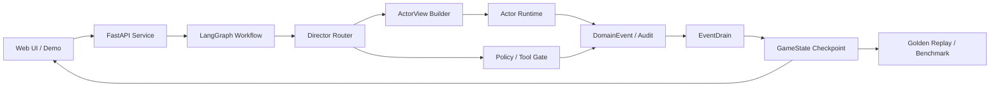

# Case Study

## Problem

Many LLM agent demos give the model broad context and let generated text imply state changes. That is risky for any stateful interactive system where hidden information, inventory, flags, and user-facing consequences must remain consistent.

Controlled Agent Sim Runtime turns a compact scenario into an engineering testbed: agents can receive scoped context, reason, speak, suggest tool calls, and propose actions, while deterministic systems own policy checks, state mutation, audit events, and replay.

## Solution

The runtime splits the workflow into explicit layers:

- `GameService` is the orchestration boundary shared by Web UI, evals, benchmark scripts, and API calls.
- LangGraph routes user input through input parsing, Director routing, mechanics, actor runtime, lore/retrieval, generation, and event drain nodes.
- `ActorView` gives each agent only the prompt slices, tools, data fields, world state, and memory it is allowed to use.
- `DomainEvent` and `EventDrain` convert proposed tool calls and consequences into deterministic state commits.
- Golden replay cases verify visibility, state transfer, memory isolation, hidden-state handling, branch outcomes, and final resolution paths without live LLM calls.

## Architecture

## Delivery

- Built a runnable vertical slice with service API, Runtime Workbench, scenario preview, scoped payload inspector, state diff, and Director Timeline.
- Added regression gates through `pytest`, `python -m core.eval.runner --suite golden`, and `python scripts/generate_benchmark.py --dry-run --max-cases 4`.
- Kept the scenario small so technical review can focus on visibility boundaries, state ownership, eval design, and observability.

## Results

- Demonstrates a 0-to-1 AI application workflow from requirement decomposition to demo, tests, and operator inspection.
- Shows how LLM output can be integrated into a safer runtime without letting free-form generation silently rewrite authoritative state.
- Provides a concrete bridge between stateful simulation and AI tooling: the scenario is the inspectable test surface, while the reusable value is the controlled agent runtime.
