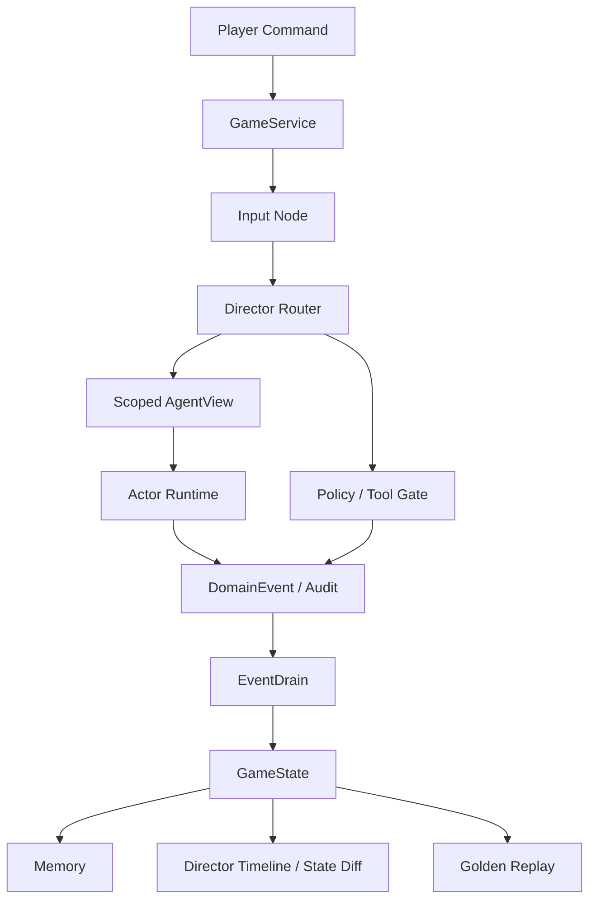

# Runtime Architecture

## Core Idea

Controlled Agent Sim Runtime separates agent expression and tool intent from authoritative state. LLM-facing nodes help interpret and speak; typed systems decide what can change.

## Important Contracts

| Contract | Purpose | Evidence |
| --- | --- | --- |
| `ActorView` | Limits what each agent can see and which tools it can call before generation. | Prompt slices, tool allowlists, hidden flags, private memory, and actor-specific context can be tested. |
| `DomainEvent` | Represents state mutations and tool outcomes as typed records. | Inventory, flags, tool approvals, damage, affection, and memory writes are not implied by prose. |
| `EventDrain` | Applies queued events to authoritative state and audit logs. | One path owns final commits, making replay and debugging tractable. |
| `MemoryService` | Stores scoped memories and retrieves relevant context. | Long-running behavior avoids dumping raw global history into every prompt. |
| Golden evals | Replays scenario cases without live models. | Regression cases cover routing, visibility, hidden-state handling, and final outcomes. |
| Director Timeline | Explains runtime decisions to an operator. | The UI exposes route stages, payloads, and state diffs during a demo. |

## Data Flow

1. The user enters dialogue or an action in the Web UI.
2. FastAPI sends the request to `GameService`.
3. LangGraph routes the request through input parsing, Director routing, mechanics, actor runtime, lore/retrieval, generation, and event drain.
4. Actors receive scoped `ActorView` payloads rather than raw global state.
5. Deterministic systems emit `DomainEvent` records for tool approvals, blocked actions, and authoritative changes.
6. `EventDrain` commits changes into checkpointed runtime state.
7. The UI renders narration, agent barks, dice/check feedback, state diffs, and the Director Timeline.
8. Golden replay cases use the same service-level behavior to catch regressions.

## Why This Pattern Generalizes

The same pattern applies beyond this demo:

- customer-service agents need scoped customer and policy context;
- internal coding agents need bounded filesystem and approval policies;
- operations assistants need typed action records and replayable audits;
- interactive AI agents need hidden-state safety and deterministic state updates.
- internal tool agents need scoped tool permissions, schema checks, and audit commits.

The scenario preview makes those constraints visible in a compact, testable form, while the Web workbench presents the same pattern as business-shaped tool orchestration.
